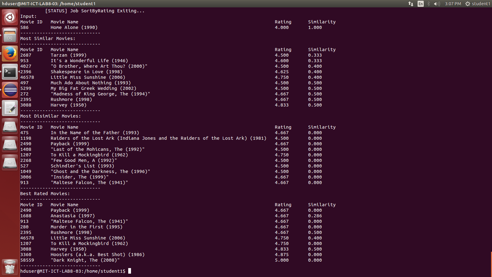

# tangent
Tangent is a Hadoop based movie recommendation system, which recommends both similar and dissimilar movies. It is based on the idea of the paper [Tangent: A novel, "Surprise-me", recommendation algorithm](dl.acm.org/citation.cfm?doid=1557019.1557093) and uses the [MovieLens](https://grouplens.org/datasets/movielens/) dataset.

# Running Tangent
Tangent can be run via the prebuilt jar or compiled from source.
1. In HDFS, create working directory and "output" folder inside it
  + If you used the prebuilt jar, the working directory must be /user/dhruv
  + If you want to change the working directory, you must compile from source and make the relevant changes in Constants.java
2. Load dataset into root of working directory. Note that the csv files should not have a header row.
3. Run the jar via a terminal: `hadoop jar tangent.jar tangent.Tangent <movieID> <rating>`
  + Find the movieID you need from the movies.csv file
  + Valid ratings are between 0 to 5 (inclusive) in .5 increments (so 4.5 is a valid rating).
  
**Important**: Due to the use of some static variables, Tangent must currently be run on a single-node Hadoop cluster. The changes required to run on a multi-node cluster will be listed in a seperate section.

# Screenshots
GoldenEye rated 4: 
Home Alone rated 4: 
